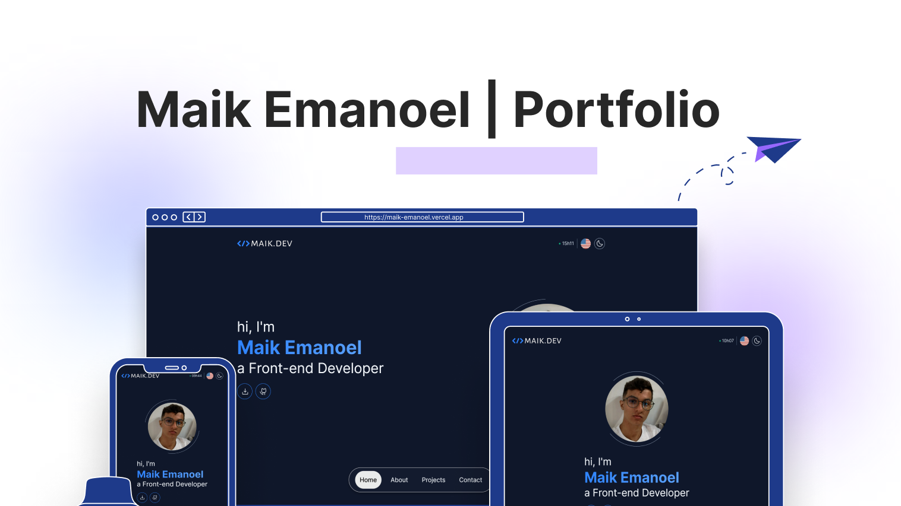

<h1 align="center"> Maik Emanoel | Portfolio </h1>

[Clique aqui para acessar](https://maik-emanoel.vercel.app/)

Case you want to see in pt-br, click in the link below:

## 🚀 Technologies

This project was developed with the following technologies:

- [React](https://react.dev/)
- [Next.js](https://nextjs.org/)
- [Typescript](https://www.typescriptlang.org/)
- [Tailwind CSS](https://tailwindcss.com/)
- [next-intl](https://next-intl-docs.vercel.app/)
- [next-themes](https://github.com/pacocoursey/next-themes)
- [react-magic-motion](https://www.react-magic-motion.com/)
- [Swiperjs](https://swiperjs.com/)
- [Email.js](https://www.emailjs.com/)
- [Phosphor-icons](https://phosphoricons.com/)
- [react-icons](https://react-icons.github.io/react-icons/)
- Git and GitHub

## 💻 Projects

This is my portfolio—a space where you can know more about me and my skills. Discover the projects I've worked on and gain insights into my expertise.  

## 🔧 Functionalities

- Three available  theme options: Dark, light and system preference;
- Responsive layout;
- Background cursor effect;
- Multilingual Support;
- Scroll animations;
- Active section highlight;
- Effects hover;
- Infinite Slider Animation;
- Projects showcase;
- Email Communication;
- Convenient Back Button.

And much more possibilities. Get in to find them.

## 🔖 Layout

This layout was all created by me, but some elements were inspired from some existing portfolios.

## Feedback

If you have some feedback, please let me know by contato.maikemanoel@gmail.com
