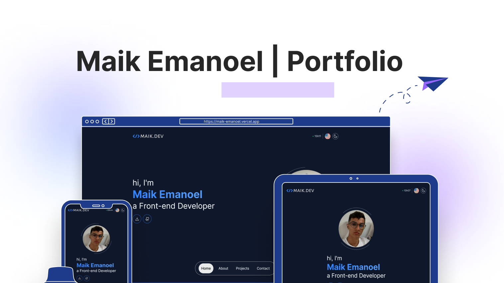

<h1 align="center"> Maik Emanoel | Portfolio </h1>

[Clique aqui para acessar](https://maik-emanoel.vercel.app/)

Caso você queira ver em en-US, clique no link abaixo:

## 🚀 Tecnologias

Este projeto foi desenvolvido com as seguintes tecnologias:

- [React](https://react.dev/)
- [Next.js](https://nextjs.org/)
- [Typescript](https://www.typescriptlang.org/)
- [Tailwind CSS](https://tailwindcss.com/)
- [next-intl](https://next-intl-docs.vercel.app/)
- [next-themes](https://github.com/pacocoursey/next-themes)
- [react-magic-motion](https://www.react-magic-motion.com/)
- [Swiperjs](https://swiperjs.com/)
- [Email.js](https://www.emailjs.com/)
- [Phosphor-icons](https://phosphoricons.com/)
- [react-icons](https://react-icons.github.io/react-icons/)
- Git and GitHub

## 💻 Projetos

Este é o meu portfólio – um espaço onde você pode saber mais sobre mim e minhas habilidades. Descubra os projetos em que trabalhei e obtenha insights sobre minha experiência.  

## 🔧 Funcionalidades

- Três opções de temas disponíveis: Escuro, claro e preferência de sistema;
- Suporte multilíngue;
- Animações de rolagem;
- Destaque da seção ativa;
- Efeitos hover;
- Animação deslizante infinita;
- Seção de projetos;
- Comunicação por e-mail;
- Botão Voltar.

E muito mais possibilidades. Entre para encontrá-las.

## 🔖 Layout

Esse layout foi todo criado por mim, mas alguns elementos foram inspirados em alguns portfólios existentes.

## Feedback

Se você tiver algum feedback, por favor me avise por contato.maikemanoel@gmail.com
